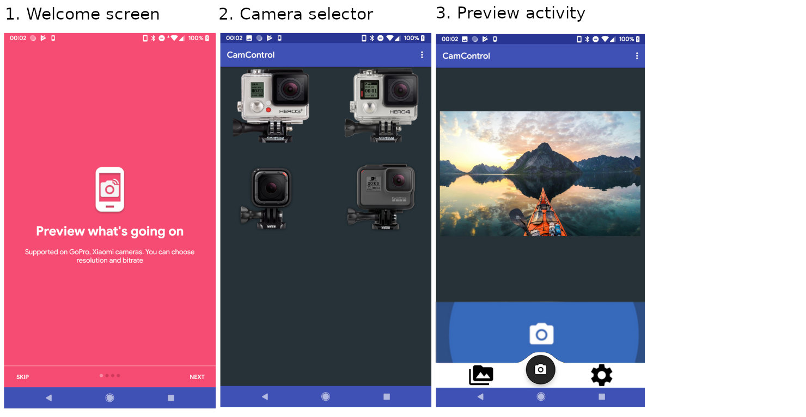

## Action Cam Control App for Android


Open source vendor agnostic client application to interface with most popular sports cameras (eg: GoPro, Yi, SJCam, etc...).

### Quick Links:

- [Bug List](https://github.com/KonradIT/CamControl/labels/bug)
- [Feature Requests](https://github.com/KonradIT/CamControl/labels/feature%20request)
- [Open Pull Requests](https://github.com/KonradIT/CamControl/pulls)
- [GoPro - Scrum board](https://github.com/KonradIT/CamControl/projects/2)
- [App - Scrum board](https://github.com/KonradIT/CamControl/projects/1)
- [GitHub Releases](https://github.com/KonradIT/CamControl/releases)

### Downloads:

Downloads will be hosted on F-Droid and the GitHub releases page.

Google Play releases will also be uploaded.

### Aims:

- Open source and login-free
- Virtually permissionless
- Support most action cameras
- Have all the features from the vendor's client
- Run without Google Play Services

### Mockup of the app UI:

*Disclaimer: Not a designer.*



### Works with:

- GoPro - [API](http://github.com/konradit/goprowifihack)

### Planned:

- Xiaomi Yi
- Insta 360 One X
- DJI Action Cameras
- Sony Action Cameras
- SJcam
- Other ChinaPro to be added

### Features:

The app must *at least* have the following features regardless of camera used:

- Preview live stream
- Control basic features eg: record, take picture, change modes, turn on or off
- Get camera status messages
- Get videos and photos off memory
- Camera detection

### Contribute!

I maintain the GoPro Wifi API and I will be doing the GoPro support, if you want to add support for your action camera:

- See the /camera/goproAPI folder, this is what provides the app with instructions and assets on how to connect to a GoPro camera, add a new folder inside /camera/ named ```camera name```API, inside you'll need to place the following files: 
	- Camera.kt: 
	    - Details about the camera(s) itself: 
	        - ```model_name``` array, 
	        - ```ip_address``` as a string, 
	        - ```baseURL```, ```statusURL```, 
	        - ```settingsURL```, 
	        - ```commandURL``` as string (with :port if needed), 
	        - ```connectionMsg``` array as string (this is to check if the camera is connected, first item should be a URL and second item should be a string), 
	        - ```info``` array with information from the vendor (eg: vendor name, vendor country, vendor website)
	- Constants.kt: 
	    - Host your commands in this file, I tend to follow a Video/Photo/MultiShot/Setup/Command structure which is easy to understand and use. Other cameras are different but try to stick to that structure.
	- Live.kt: 
	    - This should have a function called ```getStream``` that returns a Uri or a Video that ExoPlayer can play.
	- Media.kt: 
	    - Many cameras have a media front end in their IP addresses with port 8080, you'll need the URL the vendor app uses, for GoPro for instance its a JSON. It should have a ```mediaURL``` Uri and a function called ```getMedia()``` which returns an array with the URLs of the photos and videos.
	- Status.kt: 
	    - Should be a list of Strings or integers with an appropriate Status name.

### License & Libraries used

[LICENSE](https://github.com/KonradIT/CamControl/blob/master/LICENSE)

- [com.github.armcha:SpaceNavigationView](https://github.com/armcha/Space-Navigation-View)
- [de.mrmaffen:libvlc-android](https://github.com/mrmaffen/vlc-android-sdk)
- [com.github.gabrielemariotti.changeloglib](https://github.com/gabrielemariotti/changeloglib)
- [com.github.medyo:android-about-page](https://github.com/medyo/android-about-page)

### Donation:

- [PayPal](http://paypal.me/konraditurbe)
- [Liberapay](https://liberapay.com/konraditurbe/)
